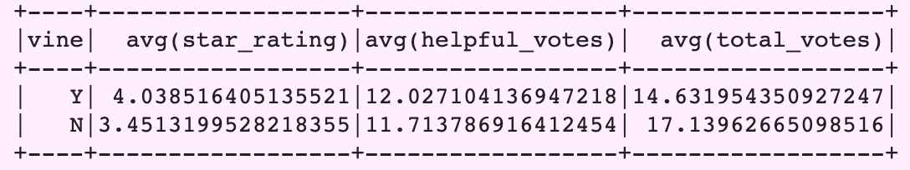
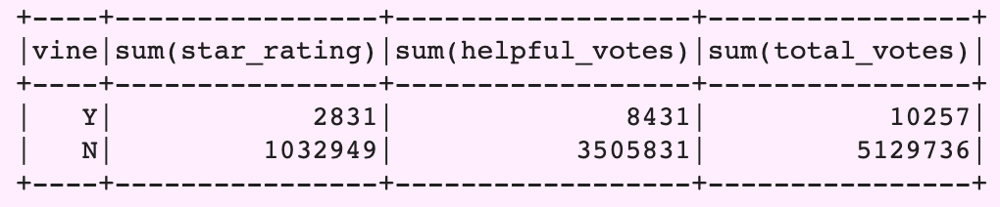
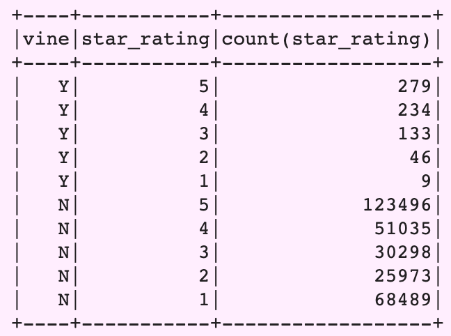
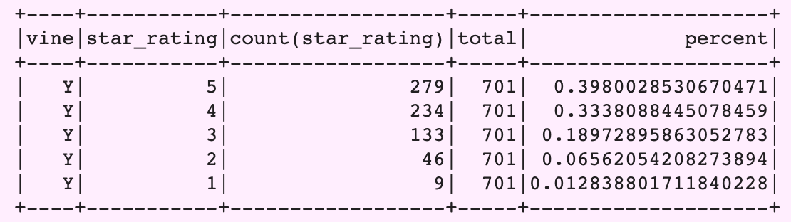
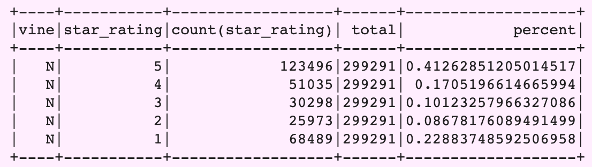
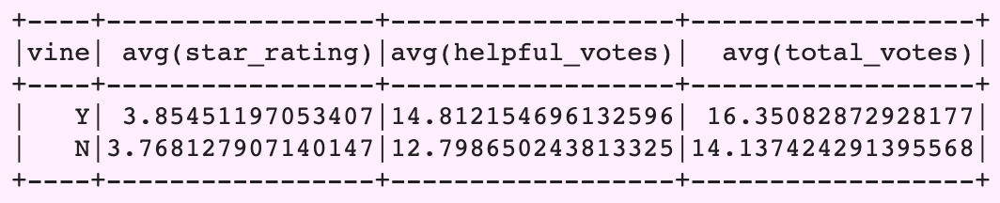
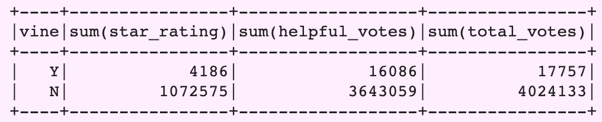
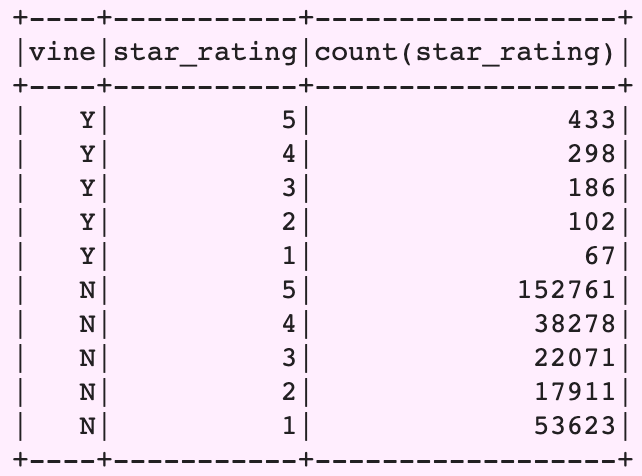
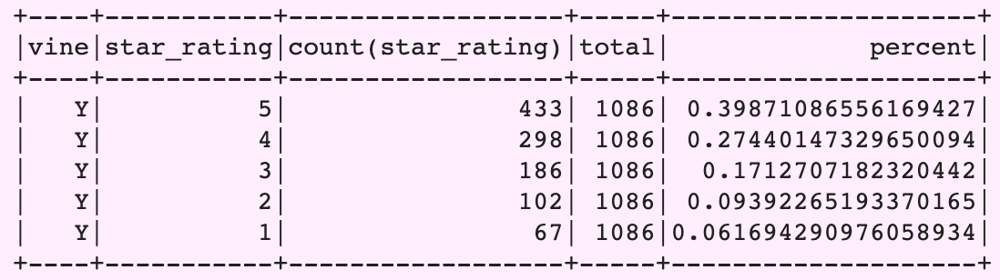
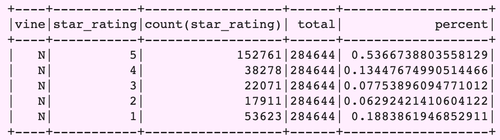

### Purpose of this analysis:
The purpose of this analysis is use to ETL processes completely in the cloud and upload a DataFrame to an AWS RDS instance, and then use PySpark to perform a statistical analysis of selected data, to determine whether reviews from Amazon's Vine program are trustworthy or biased.

---

### Data collected:
#### Video Games Reviews Analysis:

#### Pet Products Reviews Analysis:

---

### Summary of Findings- Are Vine Reviews Biased?:
For both the video games and pet products reviews, all reviews with less than 3 helpful votes were removed in order to eliminate data that wasn't helpful. Then the reviews were seperated into vine and non-vine categories.

#### Video Games
1. The average rating for vine reviews was about 0.59 stars greater than non-vine reviews, and the average amount of helpful votes for vine reviews was about 0.32 votes greater than the non-vine reviews.
1. When vine and non-vine reviews were further grouped by the star rating, this is how vine reviews compared to non-vine reviews:
    1. 5-Stars: -0.01%
    1. 4-Stars: +0.16%
    1. 3-Stars: +0.09%
    1. 2-Stars: -0.02%
    1. 1-Star: -0.22%
1. As you can see, vine reviews actually had a lower percentage of 5-star ratings than non-view. However, overall, both types of reviews were very close in their distribution of ratings.
1. I would not classify vine reviews for pet products as biased because their data isn't significantly different than non-vine reviews, and non-vine reviews actually have a higher percentages of 5-star ratings.

#### Pet Products
1. The average rating for vine reviews was only about 0.08 stars greater than non-vine reviews, and the average amount of helpful votes for vine reviews was about 2.01 votes greater than the non-vine reviews.
1. When vine and non-vine reviews were further grouped by the star rating, this is how vine reviews compared to non-vine reviews:
    1. 5-Stars: -0.14%
    1. 4-Stars: +0.14%
    1. 3-Stars: +0.09%
    1. 2-Stars: +0.03%
    1. 1-Star: -0.13%
1. As you can see, vine reviews actually had a lower percentage of 5-star ratings than non-view. However, overall, both types of reviews were very close in their distribution of ratings.
1. I would not classify vine reviews for pet products as biased because their data isn't significantly different than non-vine reviews, and non-vine reviews actually have a higher percentages of 5-star ratings.

---

### How to run the code:
1. Connect an RDS from AWS to PgAdmin.
1. Copy and paste the code from "schema.sql" into PgAdmin and run the query.
1. Download the files "video_games_review_analysis.ipynb" and "pet_products_review_analysis.ipynb" located in the "notebook_analyses" folder and save them to your computer.
1. Open up Google Colaboratory and upload each notebook.
1. Replace the database endpoint and password with you own information.
1. Run the whole kernal.

---

### Why the data is displayed this way:
1. The data is displayed in Google Colab using PySpark because the dataset is very large. When the analysis was performed to look at possible vine review bias, the data was aggregated into a few different dataframes so users can view the data in different ways- for example, looking at the averages and sums of the ratings and helpful votes, as well as a breakdown of counts and percentages of each rating tier.
